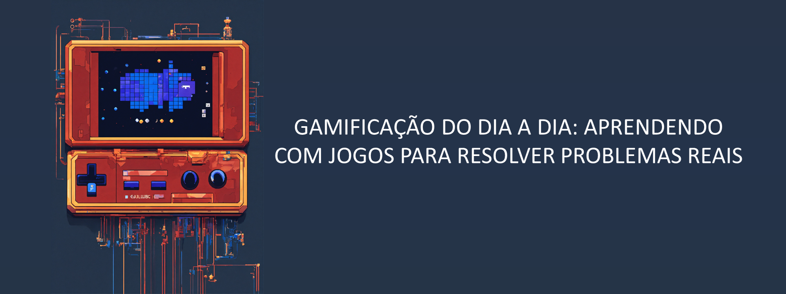
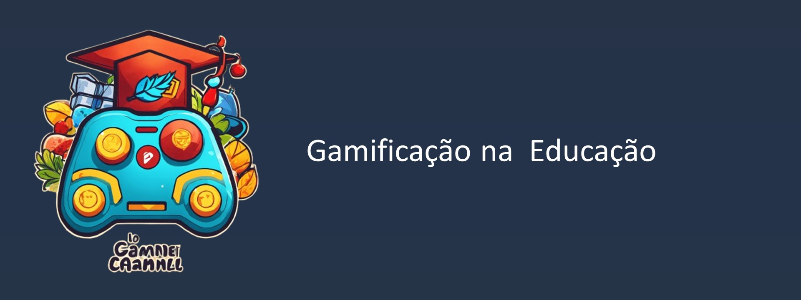

## O que é Gamificação?

Gamificação é a aplicação de elementos de jogos, como pontos, níveis, recompensas e competições, em atividades cotidianas para torná-las mais envolventes e motivadoras. Imagina transformar suas tarefas do dia a dia, como estudar ou malhar, em missões cheias de desafios e recompensas? Isso é gamificação!

  

## Benefícios da Gamificação

Os benefícios da gamificação vão além da diversão. Ela pode aumentar a produtividade, melhorar o aprendizado e até promover hábitos saudáveis. Ao transformar metas em desafios e oferecer recompensas pelas conquistas, a gamificação ajuda a manter o foco e a motivação, tornando tarefas difíceis em atividades prazerosas.

  
  

Plataformas como Duolingo são exemplos perfeitos de gamificação na educação. Elas ensinam novos idiomas de forma divertida, usando pontos, níveis, conquistas e prêmios para manter os usuários motivados e engajados no aprendizado.

  

Aplicativos de fitness, como Strava e Nike Run Club, transformam seus treinos em competições amigáveis. Você pode ganhar badges, subir no ranking e competir com amigos, o que torna a experiência de malhar muito mais motivadora e divertida.

  
  

## Aplicação no Trabalho

A gamificação no ambiente de trabalho pode revolucionar a produtividade e o engajamento dos funcionários. Transformar tarefas diárias em desafios e oferecer recompensas pode tornar o trabalho mais divertido e motivador. Empresas como Salesforce usam gamificação para motivar suas equipes de vendas, promovendo competições saudáveis e recompensando os melhores desempenhos.

  

## Desenvolvimento Pessoal

Aplicativos como Habitica transformam a criação de hábitos em um jogo. Você define metas pessoais, como ler mais ou se exercitar, e ganha pontos e recompensas ao completar essas metas. Isso ajuda a manter o foco e a disciplina de uma forma leve e divertida.

  
  

### Programas de Fidelidade

Empresas como Starbucks utilizam gamificação em seus programas de fidelidade, onde clientes acumulam pontos a cada compra e desbloqueiam recompensas. Isso não só incentiva os clientes a voltarem mais vezes, mas também torna a experiência de compra mais divertida.

  

### Sustentabilidade

Aplicativos como EcoChallenge incentivam comportamentos sustentáveis, transformando ações como reciclar e economizar energia em desafios diários. Você pode competir com amigos e ganhar prêmios ao adotar práticas mais ecológicas, tornando a sustentabilidade um jogo divertido.

#
Curtiu saber mais sobre gamificação? Quer transformar sua rotina e alcançar seus objetivos de forma divertida? Siga minhas redes sociais para mais conteúdos bacanas e dicas práticas sobre como usar a gamificação no seu dia a dia! 🚀

#Gamificação #Produtividade #Aprendizado

Ilustrações gerada pelo lexica.art e removebg

Conteúdo gerado por: ChatGPT e revisões humanas